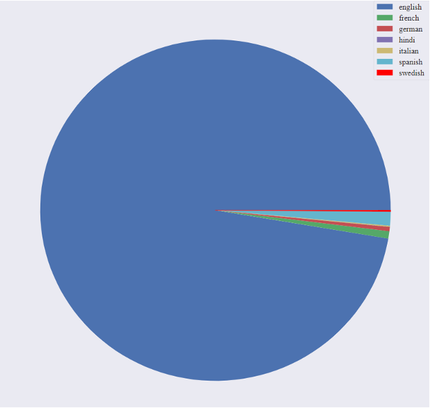
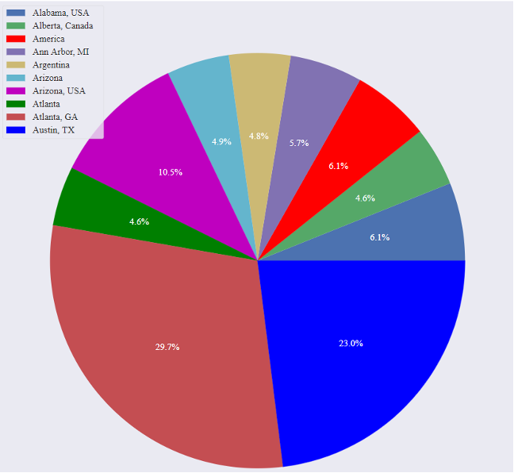
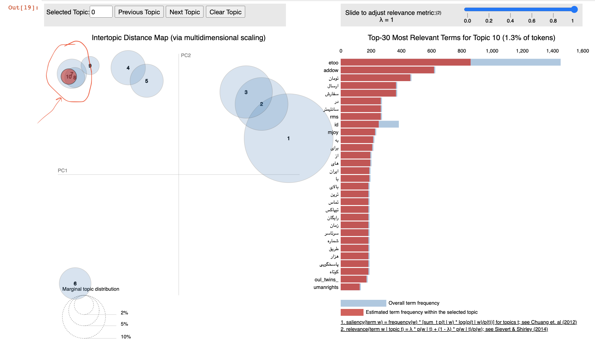

# #MeToo Movment Analysis [](https://twitter.com/) [](https://www.facebook.com/) [](https://www.instagram.com/)


**#MeToo**, a term coined by social activist Tarana Burke, to promote **empowerment through empathy** among **_sexual assault_** and **_harassment survivors_**. It became a widespread movement on social media when actress **Alyssa Milano** encouraged spreading this hashtag  to attempt to draw attention to workplace sexual violence. With more than **500,000** retweets and **12 million** posts in Facebook within first **24 hours**, **#MeToo** soon became a voice strong enough to bring down **201** Powerful Men according to The New York Times. 


_Through this project we intend to analyze the virality of data from **Data Science** perspective and add value to the social cause behind this movement._


## Our Goal: 
Suggest Targeted Approach to spread awareness and help in the society.

**Questions we intend to answer:**

1. Can we identify **real vs fake users** on the social media plateform?
2. Can we find any **similarity in beliefs and emotions** of different users and group them together?
3. **Who** is more involved in this movement?
4. What are the different **countries/regions** and **languages** that became part of **#MeToo**?
5. How can we put together all these information and **spread awareness** in a **faster** and **targeted** manner?
6. Can we **learn something new** from technology perspective?

## Data Science Pipeline:
**1. Data Collection & Storage:** we collected data from twitter and instagram social media websites.<br /> 
```Tools:``` ```python``` ```tweepy``` ```scrapy```

```python
python crawlTweets.py
scrapy crawl #metoo
```

**2. Data Cleaning:** perform following data cleaning steps: <br /> 
```Tools:``` ```python``` ```nltk``` ```pandas``` ```autocorrect```

* Remove unecessary special characters
* Remove __stopwords__
* Add __part-of-speach tagging__
* __Lemmatization__
* Remove non-supported languages
* Combining data from twitter and instagram into a single dataset

```python
python data_preprocessing.py #pre-processing the data
python combineDatasets.py #merge instagram and twitter schema into one consolidated dataset
```
**3. Exploratory Data Analysis:**

> What are the different countries/regions and languages that became part of #MeToo?
<br />

Visualize the location (captured at state, country granularity) via a pie chart using ```matplotlib``` <br />

```Insights:``` 
* __English__ was the most preferred language (90% tweets) followed by Spanish (5%) & French (1%) 
* #MeToo became most popular in __Austin__ and __Atlanta__
  
|   |   | 
| ------------- | ------------- |


**4. Fake Account Detection:** Identify fake accounts. Classify Fake(Bot) vs Real(human) account <br /> 
```Tools:``` ```matplotlib``` ```botometer``` ```sklearn``` ```RandomForestClassifier```
* Genrate training data: Use botometer python library to identify bot accounts based on twitter activity for these accounts. Ideally, in an industrial setting I would use the bot accounts identifed by SME/Human investigators as training set.
* Use the training sample generated using botometer to train a **Random Forest Classifier** model and apply it on test set.
  
```python
python bot_human/labelData.py #this will call the botometer library to label some of the data as bot or human.  
python bot_human/bot_human_custom.py #this will generate 2 files, 1 called prediction_bot_humans.csv with the classification predicted by the algorithm and a file called humans.csv which will only contain the records that were classified as non-fake accounts.  
bot_human/bot_human.ipynb #this will contain the Random Forest and Decision Tree classifiers.
```

**5. Topic Modeling:** to answer our question 
> Can we find any similarity in beliefs and emotions of different users and group them together?

we performed topic modeling using statistical model **Latent Dirichlet Allocation (LDA)**, a _generative probabilistic model_ that assumes each topic is a mixture over an underlying set of words, and each document is a mixture of over a set of topic probabilities to **uncovering hidden structure** in a collection of texts to uncover hidden topics.

```Tools:``` ```LDA``` ```TextBlob``` ```Visualization``` ```InfoMap```

* Train Topic Model with different variants of LDA to get the optimal model and perform EDA.
* Visualize the topic distribution and Calculate the similarity of different topics to get the overlap between the topics.
* Design topic clusters and Calculate the sentiments using textblob and belief propagation algorithm.
<br />

```Topic modeling Visualization``` <br />

 <br />

```Insight```
* Topic modeling is able to uncover tweets that are in language other then English, as highlighted in the diagram, cluster 7, 8, 10.
* Show overlap between non-english language cluster dispite being different lanuguage for each of the cluster 7, 8, 9.

**6. Sentiment Analysis:**


5. Network Clustering
6. Sentiment Analysis
7. Visualization

<br /><br /><br /><br /><br /><br />
==================

Welcome to the Me Too Analysis repository.
This project has the intend of suggest a targeted approach to spread awareness and help in the society.

We followed the following pipeline:
1. Data Collection. We collected data from twitter and instagram
2. Data Integration. Combined both schemas into a twitter format.
3. Data Cleansing. Remove unecessary characters, stopwords, lemmentation, etc.
4. Perform EDA.
5. Detect Fake vs Real accounts.Custom algorithm to predict if an account is a bot or a human. Generate new file only with humans.
6. Apply topic modeling algorithms like LDA, MalletLDA
7. Create network clusters. Design community clusters of Retweet and Topic network and find primary influencers.
8. Calculate sentiments of each topic cluster based on weighted average of sentiments scores of hashtags network through loopy belief propagation algorithm and lexical scores of the tweets given by textblob.
9. Create visualization component in D3 with final findings.
10. Create an webapp of the datascience process flow along with visualizations.


Steps to execute:  
Pre-requisites.  
* Generate your developer keys from twitter's site.  

Data Collection:    
1. Open the crawlTweets.py file and modify the keys to match yours.  
2. Run -> python crawlTweets.py. This will generate 2 files metoo_2019.csv and metoo_2018_2017.csv  
3. Run the scrapper -> scrapy crawl #metoo . This will generate a file called metoo_2019.json  

Data Cleaning and Integration  
4. Run -> python data_preprocessing.py. This will generate a bunch of files that will do the data cleansing piece.  
5. Run -> python combineDatasets.py . This will integrate instagram and twitter schema into one consolidated one.  

Algorithms: Identify fake accounts. Classify Fake(Bot) vs Real(human) account  
6. Run -> python labelData.py . This will call the botometer library to label some of the data as bot or human.  
7. Run -> python bot_human_custom.py . This will generate 2 files, 1 called prediction_bot_humans.csv with the classification predicted by the algorithm and a file called humans.csv which will only contain the records that were classified as non-fake accounts.  
8. Run-> bot_human.ipynb. This will contain the Random Forest and Decision Tree classifiers.

Algorithms: Retweet Network Analysis  
The Retweet Network folder contains all the output files, visualization and the code for Retweet Network Analysis  
8. Run -> Retweet Network/retweet_graph.ipynb . This python notebook maps data graphically and performs network analysis. In the process it calls retweet_graph_lpa.py which is a pyspark implementation for detecting community clusters and finding influencers.  

Algorithm: Topic modeling,clustering,sentiments analysis  
Topic_modeling_clustering_sentiments contains all the files for this analysis.  
9. Run -> Topic_modeling_clustering_sentiments/input_HG.ipynb . This python notebook prepares input for Hashtag network  
10. Run -> Topic_modeling_clustering_sentiments/LBP.ipynb . This python notebook prepares runs loopy belief algorithm to compute sentiment scores for Hashtag network  
11. Run -> Topic_modeling_clustering_sentiments/topic_modeling_clustering_sentiments.ipynb . This python notebook performs topic modeling, detects topic community and calculates sentiments of each of the communities using outputs from above two processes.  

Overall EDA and Visualization  
Exploratory Data Analysis and Visualization  
12. Open the notebook MeToo_EDA.ipynb and run all the EDA tasks. This will generate html files that will be used by the visualization app in the future.  


